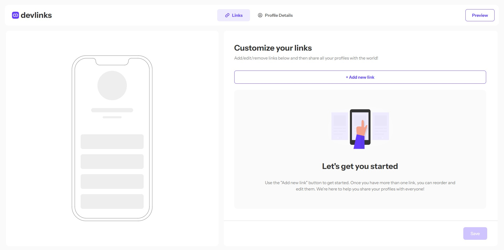

# devlinks

A link-sharing profile app — sign in, add and reorder links to your social/dev profiles, set up your profile details, and share a public preview link with anyone.

Originally built from the [Frontend Mentor Link-sharing app challenge](https://www.frontendmentor.io/challenges/linksharing-app-Fbt7yweGsT), since extended with a real backend.

Live site: https://devlinks-yfaheid.netlify.app/



## Features

- Email/password authentication
- Add, edit, remove, and drag-and-drop reorder links to 14 supported platforms (GitHub, LinkedIn, YouTube, etc.), with per-platform URL validation
- Profile details (name, email, profile photo) with validation
- Live mobile-mockup preview while editing
- A public share link (`/preview/:uid`) that renders your profile for anyone, logged in or not
- All data is scoped per-user and enforced by Firestore/Storage security rules — no user can read or write another user's data (aside from their public profile/links, which are intentionally readable by anyone)

## Tech stack

- React + Vite
- Tailwind CSS
- React Router
- Firebase (Authentication, Firestore, Storage)
- `@hello-pangea/dnd` for drag-and-drop reordering

## Getting started

```bash
npm install
```

This app needs a Firebase project with Authentication (email/password provider), Firestore, and Storage enabled. Create one at the [Firebase console](https://console.firebase.google.com/), then drop your project's web config into `src/firebase.js`.

Deploy the included security rules so data stays scoped per-user:

- `firestore.rules` — Firestore → Rules
- `storage.rules` — Storage → Rules

```bash
npm run dev      # start the dev server
npm run build    # production build
npm run lint     # lint the project
```

## Author

- Frontend Mentor - [@yfaheid](https://www.frontendmentor.io/profile/yfaheid)
