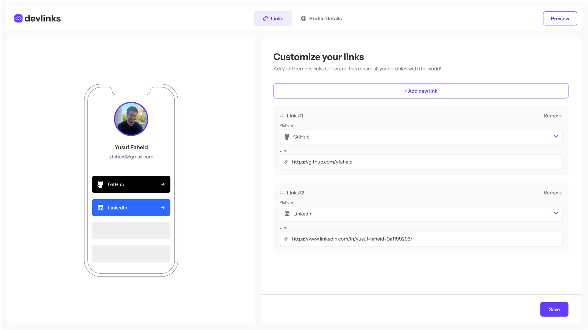

# devlinks

A link-sharing app for developers: sign up, add links to your profiles (GitHub, LinkedIn, Twitter, etc.), customize your public profile, and share a single link that shows them all.

**Live site:** https://devlinks-yfaheid.netlify.app/



## Features

- Email/password authentication
- Add, edit, remove, and drag-and-drop reorder links to popular developer platforms (GitHub, Twitter, LinkedIn, YouTube, and more), with per-platform URL validation
- Set profile details — first name, last name, email, and a profile photo
- Live mobile-mockup preview of your profile as you edit
- A public, shareable profile page at `/preview/:uid` that anyone can view without signing in
- All data is scoped per-user in Firestore, with security rules enforcing that only the owner can edit their own links and profile

## Built with

- React + Vite
- Tailwind CSS
- React Router
- Firebase (Authentication, Firestore, Storage)
- [@hello-pangea/dnd](https://github.com/hello-pangea/dnd) for drag-and-drop reordering

## Running it locally

1. Install dependencies:

   ```bash
   npm install
   ```

2. Create a Firebase project with **Authentication** (Email/Password provider), **Firestore**, and **Storage** enabled. Copy your web app config into `src/firebase.js`.

3. Deploy the included security rules to your project:
   - `firestore.rules` → Firestore → Rules
   - `storage.rules` → Storage → Rules

4. Start the dev server:

   ```bash
   npm run dev
   ```

## Author

- [@yfaheid](https://github.com/yfaheid)
